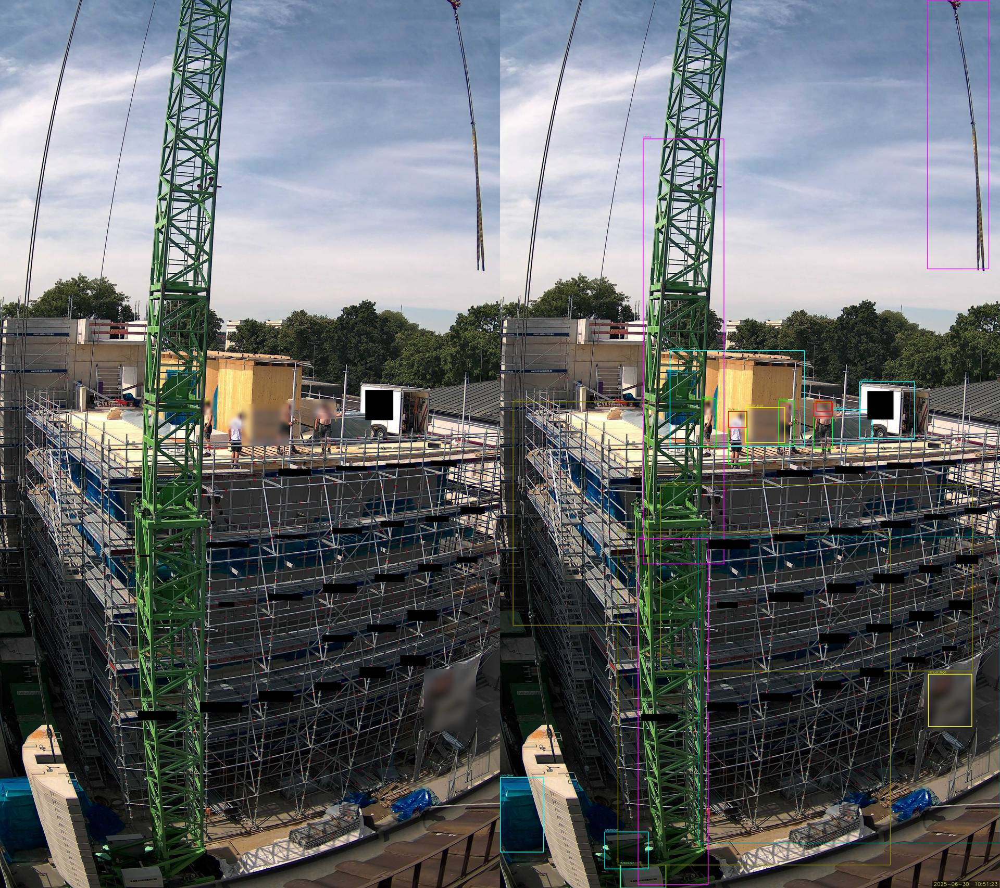

# Privacy-Aware Construction Site Monitoring Pipeline


A GDPR-compliant, open-source, on-premises privacy pipeline for construction site camera footage. Developed as part of a Bachelor's thesis at the Technical University of Munich (TUM), Chair of Computational Modeling and Simulation (CMS).

**Author:** Maximilian Drexler
**Supervisors:** Prof. Dr.-Ing. Andre Borrmann, Dr.-Ing. Fabian Pfitzner

---

## Overview

This pipeline processes raw construction site camera images through six stages to produce anonymised output suitable for public sharing or further analysis. It addresses the **anonymisation paradox** -- the necessity of processing personal data to build the very systems designed to protect it -- by implementing intelligent dataset curation that selects a small, representative training subset from a large image corpus before any manual review.

The system uses a multi-model ensemble approach combining supervised and zero-shot detectors, fused via Weighted Box Fusion (WBF), to detect and anonymise privacy-sensitive entities such as faces, persons, vehicles, and text.

### Example Results

Each image below shows the anonymised output without (left) and with (right) detection overlays, including bounding boxes, class labels, and confidence scores. In some cases, logos that were not detected by the model have been manually obscured with coloured bars. 

This example shows the full image without any exclusion zones applied. In practice, configurable zones can be defined to exclude specific image regions (e.g., sky, neighbouring properties) from detection and anonymisation, as described in the [pipeline configuration](#zone-based-privacy-masking). More examples can be found under docs/examples.

<p align="center">
  
</p>

### Detection Taxonomy (8 Classes)

| ID | Class            | Privacy-Sensitive |
|----|------------------|:-----------------:|
| 0  | face             | yes               |
| 1  | person           | yes               |
| 2  | vehicle          | yes               |
| 3  | text_or_logo     | yes               |
| 4  | crane            | no                |
| 5  | container        | no                |
| 6  | scaffolding      | no                |
| 7  | material_stack   | no                |

---

## Pipeline Architecture

```
┌─────────────┐    ┌─────────────────┐    ┌─────────────────┐
│  Stage 1    │───>│    Stage 2      │───>│    Stage 3      │
│  Pre-Filter │    │ Intelligent     │    │ Auto-Annotation │
│ (quality)   │    │ Selection       │    │ (4-model        │
│             │    │ (training       │    │  ensemble)      │
│             │    │  subset)        │    │                 │
└─────────────┘    └─────────────────┘    └─────────────────┘
                                                  │
                                        ┌─────────┴─────────┐
                                        │  Manual Review     │
                                        │  in CVAT           │
                                        └─────────┬─────────┘
                                                  │
┌─────────────┐    ┌─────────────────┐    ┌───────┴─────────┐
│  Stage 6    │<───│    Stage 5      │<───│    Stage 4      │
│  Evaluate   │    │ Anonymise       │    │ Train YOLO11    │
│ (mAP,       │    │ (3-tier blur)   │    │ Detector        │
│  privacy)   │    │                 │    │                 │
└─────────────┘    └─────────────────┘    └─────────────────┘
```

**Stages 1-4** are for model development: they select a small training subset, annotate it, and train a detector. **Stage 5** is for deployment: it applies the trained model to anonymise **all** images, not just the training subset. Stage 6 evaluates the results.

**Between Stages 3 and 4**, manual annotation correction in CVAT is required. This is the only step requiring human intervention.

---

## Project Structure

```
privacy_pipeline/
├── scripts/
│   ├── 01_prefilter.py              # Stage 1: Quality-based image filtering
│   ├── 02_intelligent_selection.py  # Stage 2: YOLO11 proxy scoring + temporal diversity
│   ├── 03_auto_annotate.py          # Stage 3: Multi-model ensemble annotation
│   ├── 04_train.py                  # Stage 4: YOLO11 fine-tuning
│   ├── 05_anonymise.py              # Stage 5: Confidence-based Gaussian blur
│   ├── 06_evaluate.py               # Stage 6: mAP, recall, privacy score
│   ├── run_stages_1_to_3.py         # Combined runner for Stages 1-3
│   ├── run_stages_4_to_6.py         # Combined runner for Stages 4-6
│   └── final_inference.py           # Multi-model inference (see below)
├── config/
│   ├── pipeline_config.yaml         # Central pipeline settings
│   ├── dataset.yaml                 # YOLO training configuration
│   ├── taxonomy.json                # 8-class taxonomy with attributes
│   └── inference.yaml               # Multi-model inference config (generated)
├── docs/
│   ├── examples/                    # Anonymised example images (60 samples)
│   └── FINAL_INFERENCE_README.md    # Detailed multi-model documentation
├── requirements.txt
├── LICENSE
└── README.md
```

---

## Prerequisites

### Software

- Docker (with NVIDIA Container Toolkit for GPU access)
- Python 3.10+
- CVAT (for manual annotation correction between Stages 3 and 4)

### Models (downloaded automatically or manually)

| Model             | Purpose                        | Source                                         |
|-------------------|--------------------------------|------------------------------------------------|
| YOLO11n (COCO)    | Proxy scoring, base detections | Ultralytics                                    |
| YOLO-Face         | Face detection                 | derronqi/yolov8-face or similar                |
| YOLO-World        | Open-vocabulary detection      | Ultralytics                                    |
| Grounding DINO    | Zero-shot grounded detection   | IDEA-Research/GroundingDINO (SwinT-OGC)        |
| CLIP (ViT-B/32)   | Detection enrichment/gating    | OpenAI                                         |

---

## Quick Start

```bash
# 1. Clone and build
git clone https://github.com/<your-username>/privacy-pipeline.git
cd privacy-pipeline && cd docker && ./build-image.sh && ./run-container.sh

# 2. Inside the container
cd /workspace/privacy_pipeline && pip install -r requirements.txt

# 3. Run stages 1-3 (raw images -> auto-annotations)
python3 scripts/run_stages_1_to_3.py \
    --raw-images /workspace/data/raw_images \
    --work-dir /workspace/data/pipeline_run \
    --num-samples 2500

# 4. Review and correct annotations in CVAT, then export as YOLO 1.1

# 5. Run stages 4-6 (train, anonymise, evaluate)
python3 scripts/run_stages_4_to_6.py \
    --dataset-yaml /workspace/data/pipeline_run/training/dataset.yaml \
    --test-images /workspace/data/pipeline_run/selected \
    --output-dir /workspace/output

# 6. Anonymise ALL images (not just the training subset)
python3 scripts/05_anonymise.py \
    --model /workspace/output/construction_v1/weights/best.pt \
    --input-dir /workspace/data/raw_images \
    --output-dir /workspace/output/anonymised_all
```

For detailed setup and configuration options, see sections below.

---

## Installation

### 1. Clone the Repository

```bash
git clone https://github.com/<your-username>/privacy-pipeline.git
cd privacy-pipeline
```

### 2. Docker Setup (Recommended)

Build the image and start a container with GPU support:

```bash
cd docker/
chmod +x build-image.sh run-container.sh
./build-image.sh
./run-container.sh          # uses GPU 0 by default
./run-container.sh 1        # or specify another GPU
./run-container.sh all      # or use all GPUs
```

By default, the following directories are mounted into the container. Adjust the paths in `run-container.sh` to match your setup:

| Host Path                        | Container Path               |
|----------------------------------|------------------------------|
| `~/data`                         | `/workspace/data`            |
| Repository root                  | `/workspace/privacy_pipeline`|
| `~/output`                       | `/workspace/output`          |

### 3. Install Dependencies (Inside Container)

```bash
cd /workspace/privacy_pipeline
pip install -r requirements.txt
```

Grounding DINO is installed automatically during the Docker build. If not present, install manually:

```bash
cd /workspace
git clone https://github.com/IDEA-Research/GroundingDINO.git
cd GroundingDINO && pip install -e .
mkdir -p weights && cd weights
wget https://github.com/IDEA-Research/GroundingDINO/releases/download/v0.1.0-alpha/groundingdino_swint_ogc.pth
```

### 4. CVAT Setup (For Annotation Review)

CVAT is used between Stages 3 and 4 for manual annotation correction. Two options:

**Option A: Self-hosted (requires Docker)**

```bash
git clone https://github.com/cvat-ai/cvat.git
cd cvat && docker compose up -d
```

Access via `http://localhost:<port>` (forward the configured port if connecting via SSH).

**Option B: Cloud-hosted**

Use the free tier at [app.cvat.ai](https://app.cvat.ai) -- no local installation required. Upload images and import `cvat_import.zip` directly in the browser. Note: this uploads images to an external server. If your data contains privacy-sensitive content (e.g. unanonymised construction site footage), use the self-hosted option to keep data on-premises.

CVAT is still required for annotation review between Stages 3 and 4.

---

## Usage

All commands below assume you are inside the Docker container:

```bash
docker exec -it privacy_pipeline /bin/bash
cd /workspace/privacy_pipeline
```

For long-running processes, use `screen`:

```bash
screen -S pipeline
# ... run commands ...
# Ctrl+A, D to detach
# screen -r pipeline to reattach
```

---

### Option A: Combined Runners

#### Stages 1-3 (Raw Images -> Auto-Annotations)

```bash
python3 scripts/run_stages_1_to_3.py \
    --raw-images /workspace/data/raw_images \
    --work-dir /workspace/data/pipeline_run \
    --num-samples 2500 \
    --workers 8
```

Quick test with a small subset:

```bash
python3 scripts/run_stages_1_to_3.py \
    --raw-images /workspace/data/raw_images \
    --work-dir /workspace/data/pipeline_test \
    --num-samples 50 \
    --max-prefilter 200
```

Key optional arguments:

| Argument             | Default | Description                              |
|----------------------|---------|------------------------------------------|
| `--min-brightness`   | 50      | Minimum brightness threshold             |
| `--max-brightness`   | 230     | Maximum brightness threshold             |
| `--min-contrast`     | 25      | Minimum contrast threshold               |
| `--min-sharpness`    | 200     | Minimum Laplacian variance               |
| `--min-edge-density` | 0.02    | Minimum Canny edge density               |
| `--use-sahi`         | False   | Enable SAHI tiled inference in Stage 3   |
| `--sahi-slice-size`  | 1496    | SAHI tile size in pixels                 |
| `--sahi-overlap`     | 0.15    | SAHI tile overlap ratio                  |
| `--wbf-iou`          | 0.35    | WBF IoU threshold for box fusion         |
| `--skip-ocr`         | False   | Skip OCR-based text detection            |
| `--skip-clip`        | False   | Skip CLIP verification of detections     |

**Output:** `{work-dir}/prefiltered/`, `{work-dir}/selected/`, `{work-dir}/auto_annotations/`

---

#### Manual Step: CVAT Annotation Correction

After Stages 1-3 complete, the auto-generated annotations must be manually reviewed and corrected before training:

1. Import annotations into CVAT:
   - Create a new Task in CVAT with the selected images
   - Actions -> Upload Annotations -> COCO 1.0 -> select `cvat_import.zip`

2. Review and correct:
   - Fix incorrect bounding boxes
   - Add missing detections (especially faces -- missed faces are GDPR violations)
   - Remove false positives
   - Useful shortcuts: `N` (new box), `D`/`A` (next/prev image), `Ctrl+S` (save)

3. Export corrected annotations:
   - Actions -> Export Task Dataset -> YOLO 1.1 format
   - Place the exported dataset where `dataset.yaml` points to

---

#### Stages 4-6 (Corrected Annotations -> Anonymised Output)

```bash
python3 scripts/run_stages_4_to_6.py \
    --dataset-yaml /workspace/data/pipeline_run/training/dataset.yaml \
    --test-images /workspace/data/pipeline_run/selected \
    --output-dir /workspace/output \
    --run-name construction_v1 \
    --epochs 100 \
    --batch 8 \
    --patience 20
```

Skip training and use an existing model:

```bash
python3 scripts/run_stages_4_to_6.py \
    --dataset-yaml /workspace/data/pipeline_run/training/dataset.yaml \
    --test-images /workspace/data/pipeline_run/selected \
    --output-dir /workspace/output \
    --model /workspace/output/construction_v1/weights/best.pt \
    --skip-training
```

Key optional arguments:

| Argument             | Default          | Description                              |
|----------------------|------------------|------------------------------------------|
| `--epochs`           | 100              | Maximum training epochs                  |
| `--batch`            | 8                | Batch size                               |
| `--patience`         | 20               | Early stopping patience                  |
| `--run-name`         | construction_v1  | Experiment name                          |
| `--skip-training`    | False            | Use existing model, skip training        |
| `--model`            | None             | Path to existing model (with --skip-training) |
| `--no-body-blur`     | False            | Disable tier-3 body blur                 |
| `--no-metadata`      | False            | Disable timestamp overlay on output      |

#### Anonymise All Images

After training and evaluation, apply the model to your **entire** image corpus:

```bash
python3 scripts/05_anonymise.py \
    --model /workspace/output/construction_v1/weights/best.pt \
    --input-dir /workspace/data/raw_images \
    --output-dir /workspace/output/anonymised_all
```

---

### Option B: Individual Stages

#### Stage 1: Pre-Filter

Filters out low-quality images (dark, overexposed, blurry, empty) using zone-cropped quality metrics. No ML models are used.

```bash
python3 scripts/01_prefilter.py \
    --input-dir /workspace/data/raw_images \
    --output-dir /workspace/data/prefiltered \
    --workers 8
```

**Output:** `accepted_images.csv` (index of images passing quality thresholds)

#### Stage 2: Intelligent Selection

Scores accepted images using a COCO-pretrained YOLO11 model as a proxy for content relevance. Enforces temporal diversity (minimum 3-minute gap, maximum 5 images per hour).

```bash
python3 scripts/02_intelligent_selection.py \
    --input-dir /workspace/data/raw_images \
    --output-dir /workspace/data/selected \
    --index-file /workspace/data/prefiltered/accepted_images.csv \
    --num-images 2500
```

**Output:** Selected images copied to output directory with `selection_stats.json`

#### Stage 3: Auto-Annotation

Runs a four-model ensemble (YOLO11 COCO, YOLO-Face, YOLO-World, Grounding DINO) with Weighted Box Fusion and optional CLIP gating and OCR.

```bash
python3 scripts/03_auto_annotate.py \
    --input-dir /workspace/data/selected \
    --output-dir /workspace/data/auto_annotations \
    --use-sahi \
    --sahi-slice-size 1496 \
    --sahi-overlap 0.15 \
    --wbf-iou 0.35 \
    --skip-ocr
```

Key optional arguments:

| Argument              | Default | Description                              |
|-----------------------|---------|------------------------------------------|
| `--use-sahi`          | False   | Enable SAHI tiled inference              |
| `--sahi-slice-size`   | 640     | SAHI tile size in pixels                 |
| `--sahi-overlap`      | 0.25    | SAHI tile overlap ratio                  |
| `--wbf-iou`           | 0.35    | WBF IoU threshold for box fusion         |
| `--skip-ocr`          | False   | Skip OCR-based text detection            |
| `--skip-clip`         | False   | Skip CLIP verification of detections     |
| `--no-grounding-dino` | False   | Disable Grounding DINO model             |
| `--max-images`        | None    | Limit number of images (for testing)     |

**Output:** `yolo_labels/`, `cvat_import.zip`, annotation statistics

#### Stage 4: Train YOLO11 Detector

Fine-tunes YOLO11 on the manually corrected annotations.

```bash
python3 scripts/04_train.py \
    --dataset-yaml /workspace/data/training/dataset.yaml \
    --output-dir /workspace/output \
    --run-name construction_v1 \
    --epochs 100 \
    --batch 8 \
    --patience 20
```

Key optional arguments:

| Argument         | Default          | Description                        |
|------------------|------------------|------------------------------------|
| `--epochs`       | 100              | Maximum training epochs            |
| `--batch`        | 16               | Batch size                         |
| `--patience`     | 20               | Early stopping patience            |
| `--name`         | construction_v1  | Experiment name                    |
| `--model`        | yolo11n.pt       | Base model weights                 |
| `--val-ratio`    | 0.2              | Validation split ratio             |
| `--skip-train`   | False            | Only prepare dataset, skip training|

**Output:** Trained model weights at `{output-dir}/{run-name}/weights/best.pt`

### Stage 5: Anonymise

Applies class-specific Gaussian blur with dynamic kernel sizing (kernel = strength x min dimension of bounding box). If the input filenames follow the convention `Kamera[N]_00_YYYYMMDDHHMMSS.jpg`, the capture timestamp is overlaid in the bottom-right corner of each anonymised image. Use `--no-metadata` to disable this.

**Person detections -- confidence-based escalation:**

| Tier | Condition | Strategy | Strength |
|------|-----------|----------|----------|
| 1 | Face detected, high confidence | Blur face region + padding | 2.0 |
| 1.5 | Small person reclassified as face | Blur entire detection + padding | 2.0 |
| 2 | Face detected, low confidence | Blur face region + doubled padding | 2.0 |
| 3 | No face detected | Blur top 33% of person bounding box | body kernel |

**Other classes:**

| Class | Strategy | Strength |
|-------|----------|----------|
| text_or_logo | Blur entire bounding box + padding | 1.0 |
| vehicle, crane, container, scaffolding, material_stack | No blur | -- |

```bash
python3 scripts/05_anonymise.py \
    --input-dir /workspace/data/selected \
    --output-dir /workspace/output/anonymised \
    --model /workspace/output/construction_v1/weights/best.pt
```

Key optional arguments:

| Argument             | Default | Description                              |
|----------------------|---------|------------------------------------------|
| `--confidence`       | 0.25    | Detection confidence threshold           |
| `--face-high-thresh` | 0.5     | Tier-1 face confidence threshold         |
| `--blur-strength`    | 51      | Base Gaussian kernel size                |
| `--no-body-blur`     | False   | Disable tier-3 body blur                 |
| `--no-metadata`      | False   | Disable timestamp overlay on output images |
| `--draw-detections`  | False   | Draw bounding boxes on output            |
| `--zones-config`     | None    | JSON config for static zone masks        |
| `--max-images`       | None    | Limit number of images (for testing)     |

**Output:** Anonymised images in output directory

#### Stage 6: Evaluate

Computes mAP, per-class precision/recall, and a composite privacy score.

```bash
python3 scripts/06_evaluate.py \
    --dataset-yaml /workspace/data/training/dataset.yaml \
    --model /workspace/output/construction_v1/weights/best.pt \
    --output-dir /workspace/output/evaluation
```

**Output:** Evaluation metrics as JSON and printed summary

---

## Multi-Model Deployment (Advanced)

If a single trained model does not achieve satisfactory results for all classes (particularly face detection), the pipeline supports combining multiple specialised models at inference time.

This approach is config-driven: a YAML file specifies which models to load, which classes each model handles, and how overlapping detections are merged.

```bash
# Generate a default config
python3 scripts/final_inference.py --generate-config config/inference.yaml

# Edit config/inference.yaml to set your model paths and class assignments

# Run multi-model inference
python3 scripts/final_inference.py \
    --config config/inference.yaml \
    --input-dir /workspace/data/raw_images \
    --output-dir /workspace/output/final

# With bounding box overlay for review
python3 scripts/final_inference.py \
    --config config/inference.yaml \
    --input-dir /workspace/data/raw_images \
    --output-dir /workspace/output/final \
    --vis
```

Pre-trained weights for this thesis are available as a GitHub Release:

| Model | File | Classes |
|-------|------|---------|
| General detector | `v12_general.pt` | person, vehicle, text_or_logo, crane, container, scaffolding, material_stack |
| Face detector | `face_only.pt` | face |
| Person supplement | `v11_person_supplement.pt` | person (additional detections) |

**Note:** If your single model from Stage 4 performs well across all classes, you do not need multi-model inference. Proceed directly with Stage 5.

For details on configuration, training specialised models, and integration, see [docs/final_inference_readme.md](docs/final_inference_readme.md).

---

## Configuration

### pipeline_config.yaml

Central configuration file for thresholds, model paths, and processing parameters. Located at `config/pipeline_config.yaml`. Individual stage scripts accept command-line arguments that override these defaults.

### dataset.yaml

YOLO training configuration specifying train/val splits and class names. Adjust paths to match your data directory layout.

### taxonomy.json

Defines the 8-class detection taxonomy with attributes (e.g., `privacy_sensitive: true/false`, `face_visible`, `partially_occluded`).

### inference.yaml

Multi-model inference configuration. Generated via `final_inference.py --generate-config`. Specifies model paths, class assignments, WBF settings, and anonymisation parameters. See [docs/final_inference_readme.md](docs/final_inference_readme.md).

### Zone-Based Privacy Masking

Static zones define image regions that are blurred before detection, such as neighbouring buildings, sky, or camera mounting hardware. Blurring zones on the input image ensures that no personal data within excluded regions is processed by the detector. Zones are defined per camera setup in `config/zones.json`.
```json
{
  "setup_1": {
    "description": "Camera 1",
    "zones": [
      {"name": "Sky", "polygon": "full_width_top_25"},
      {"name": "Right edge", "polygon": "right_5"},
      {"name": "Bottom edge", "polygon": "full_width_bottom_5"}
    ]
  }
}
```

Supported shorthands: `full_width_top_N`, `full_width_bottom_N`, `right_N`, `left_N` (where N is the percentage of the image dimension). For irregular regions, use explicit pixel coordinates: `[[x1,y1], [x2,y2], ...]`.

Pass `--zones-config config/zones.json` to Stage 5 or `final_inference.py`.

---

## Typical Workflow

```
1. Place raw images in /workspace/data/raw_images/

2. Run Stages 1-3 (selects training subset, generates annotations):
   python3 scripts/run_stages_1_to_3.py --raw-images ... --work-dir ...

3. Import cvat_import.zip into CVAT, review and correct annotations

4. Export corrected annotations from CVAT in YOLO 1.1 format

5. Run Stages 4-6 (train model, anonymise training subset, evaluate):
   python3 scripts/run_stages_4_to_6.py --dataset-yaml ... --test-images ...

6. If satisfied: anonymise ALL images with the trained model:
   python3 scripts/05_anonymise.py --model ... --input-dir /all/images --output-dir ...

   To also output images with bounding box overlays for review:
   python3 scripts/05_anonymise.py --model ... --input-dir ... --output-dir ... --draw-detections

7. If face detection needs improvement: train a specialised model,
   configure multi-model inference (see docs/FINAL_INFERENCE_README.md),
   then anonymise all images with:
   python3 scripts/final_inference.py --config ... --input-dir /all/images

   With bounding box overlay:
   python3 scripts/final_inference.py --config ... --input-dir /all/images --vis
```

All output images are always anonymised. The `--vis` flag (final_inference) and `--draw-detections` flag (Stage 5) add bounding box overlays on top of the anonymised output for review purposes. Labels in YOLO format are always saved to `output-dir/labels/`.

---

## Citation

If you use this pipeline in your research, please cite:

```bibtex
@thesis{drexler2026privacy,
  author  = {Drexler, Maximilian},
  title   = {Data Collection and Privacy-Aware Monitoring of {TUM} Kita
             Construction Site Using Camera-Based Systems},
  school  = {Technical University of Munich},
  year    = {2026},
  type    = {Bachelor's Thesis}
}
```

---

## Acknowledgements

This work was conducted at the Chair of Computational Modeling and Simulation (CMS), TUM School of Engineering and Design, Technical University of Munich. Special thanks to Prof. Dr.-Ing. Andre Borrmann and Dr.-Ing. Fabian Pfitzner for their supervision and guidance.

---

## License

MIT License. See [LICENSE](LICENSE) for details.
